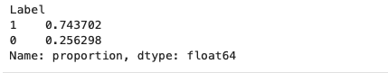
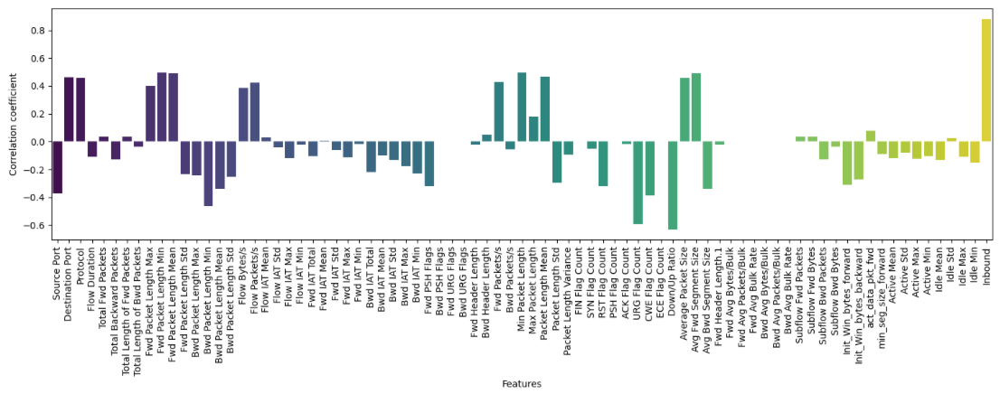
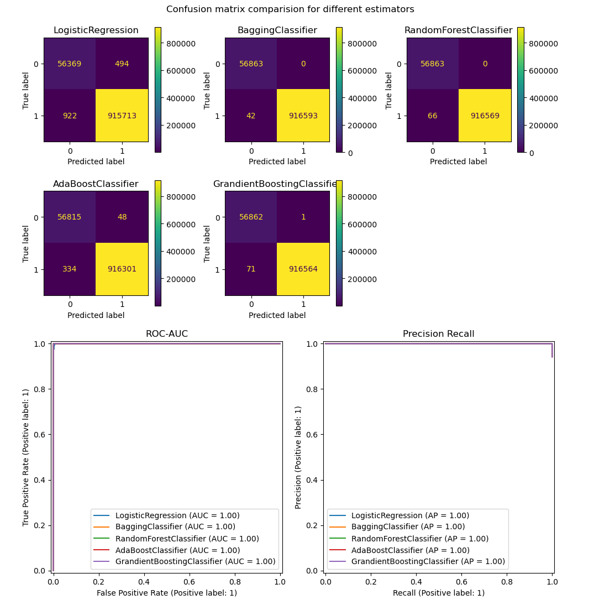
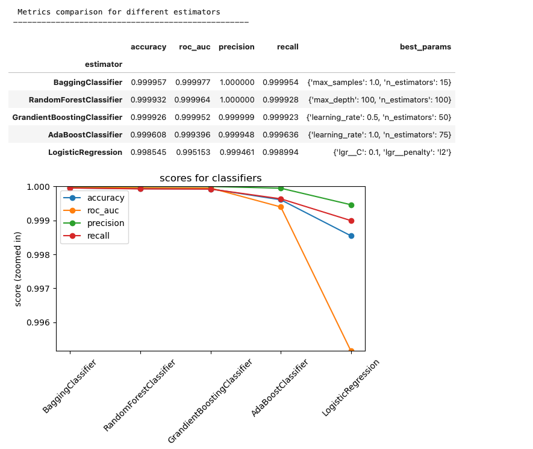
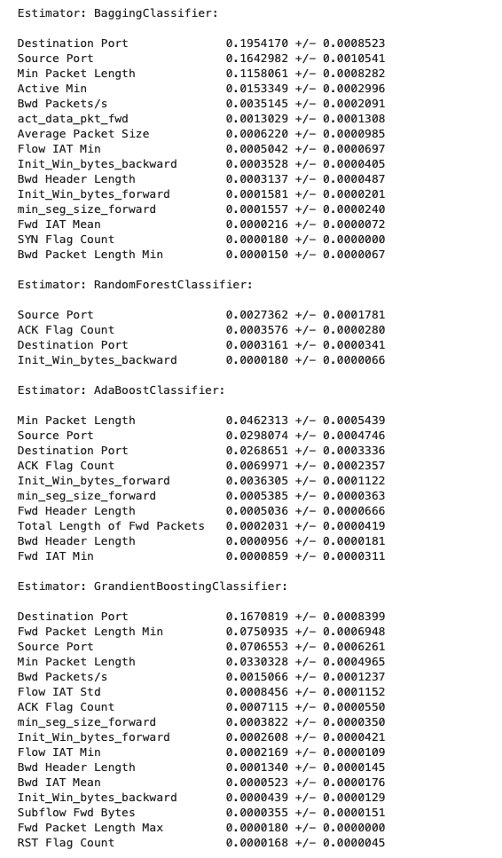

# OVERVIEW

This README has the analysis for detecting distributed denial of service (DDoS) attacks and classifying network traffic as nornal traffic (BENIGN) or as attack (DoS) traffic. The research question that this analysis is attempting to answer is "Given network data, does it indicate a DDoS attack or is it normal network traffic?"

Link to repository: [Git Repository](https://github.com/raosalapaka/ml-ddos.git)

Link to github: [Github](https://github.com/raosalapaka/ml-ddos)

Link to jupyter notebook: [Capstone DDoS Project](https://github.com/raosalapaka/ml-ddos/blob/main/capstone_ddos_RS.ipynb), [Capstone DDoS LDAP](https://github.com/raosalapaka/ml-ddos/blob/main/capstone_ddos_ldap.ipynb)

Following datasets were considered for this project:
- [Kaggle comprehensive dataset for ddos attack](https://www.kaggle.com/datasets/amanverma1999/a-comprehensive-dataset-for-ddos-attack)
- [Kaggle ddos dataset](https://www.kaggle.com/datasets/devendra416/ddos-datasets)
- [CICDDoS2019 dataset](http://cicresearch.ca//CICDataset/CICDDoS2019/)

The dataset used for this analysis is the [CICDDoS2019 dataset](http://cicresearch.ca//CICDataset/CICDDoS2019/) which is provided by the [Canadian Institute of Cybersecurity, University of New Brunswick](https://www.unb.ca/cic/datasets/ddos-2019.html). The main reason was the richness of various features that were captured in simulated attacks on many different network protocols (like LDAP, NetBIOS, UDP, Syn/TCP, NTP, etc.). A good analysis on how the data was generated and the taxonomy is captured in this paper: [Developing Realistic Distributed Denial of Service DDoS Attack Dataset and Taxonomy](https://www.researchgate.net/profile/Arash-Habibi-Lashkari/publication/336953914_Developing_Realistic_Distributed_Denial_of_Service_DDoS_Attack_Dataset_and_Taxonomy/links/5de66c9592851c83645fad89/Developing-Realistic-Distributed-Denial-of-Service-DDoS-Attack-Dataset-and-Taxonomy.pdf)

## Github directory structure
ml-ddos is the root git directory and has the following:

- **Screenshots**: directory has the screenshots that are used in this file (README.md)

- **archive**: directory has the previously uploaded README version with its Screenshots

- **data/CICDDoS2019/sampled_data**: has the data files split in chunks of 3 files for each protocol. This is done to work around the size constraints of git storage

- **README.md** file: this file

- **capstone_ddos_data_RS.ipynb**: this is the notebook that does initial data analysis of the files in CICDDoS2019 dataset. The output from this notebook is sampled data for each protocol to constrain the number of data rows to be more manageable for both git and the analysis

- **capstone_ddos_project_RS.ipynb**: this notebook has the analysis to compare different estimators and choose the best estimator for the DDoS detection project

- **ddos_dataset_and_taxonomy.pdf**: paper describing the datset used in this project

# Classifying DDoS network attacks (Final Report)

## Summary

**CRISP-DM** framework was followed to do the analysis.

- **Business Understanding**: DDoS attacks can disrupt a cloud service which in turn can lead to multiple issues that can pose a material revenue risk for a business. It can lead to many issues including which could have direct impact on businesss, not limited to the following:

    - increase in service outage resulting in erosion of customer trust
    - loss of revenue (sales may be disrupted because of outage),
    - trigger SLA breaches for paying customers (especially enterprise customers) which usually carry some kind of fines
    - reputation and brand damage
    - increased engineering costs in mitigating the issue (which could be prevented by early detection systems)
    - lately there is also ransomware scenarios where attackers can demand compensation for stopping attacks

- [Data Understanding](#Data-Understanding)
    - The dataset has 88 columns per protocol file (mostly numeric)
    - The dataset has no missing values
    - The target column (Label) is not balanced

- [Data Preparation](#Data-Preparation)
    - cleaned data by dropping columns
    - cleaned data by imputing values marked as float.inf
    - converted target column to binary

- [Modeling](#Modeling)
    - Used cross validation with 5 folds for validation during training
    - Ran estimators both LogisticRegression, and ensemble estimators (Bagging and Boosting)
    - Ran Grid search to fine tune hyper parameters with cross validation during training

- [Evaluation](#Evaluation)
    - Used metrics of accuracy, roc-auc, precision-recall to evaluate
    - The estimators all performed well on the test data. The test data was collected by using the attack/normal traffic from unseen sampled data files (new for the trained models)
    - Precision was almost perfect - likely because of the large numbers of rows skewed to attack data

- [Deployment](#Deployment)
    - best model was Bagging and RandomForest classifiers
    - Deployment section identifies the important features

- [Future work](#Future-work)
    - future work identified for generalizing the models better
    - eventually, use the flows in a specific time span (using timestamp column) to adapt the data to detect real time attacks using time-series models 

## Details

### Data Understanding

### Initial exploration

<mark>**Background**</mark>: The data files downloaded from the CICDDoS2019 dataset has the attack data divided by protocols. The approach that was taken was to generate simulated attack data for protocols: DNS, LDAP, MSSQL, NetBIOS, NTP, SNMP, SSDP, UDP, TCP/Syn, TFTP. Features (88 in number) were aggregated from this data (some of the columns are generated) based on the flows which are identified by quintuble <Src IP Address, Destination IP Address, Src Port, Destination Port, Protocol>

Some observations from initial exploration and the actions taken (this is in the capstone_ddos_RS.ipynb notebook)

- The raw files for each protocol were huge with millions of rows making it not practical to analyze with compute resources available. ***Action taken***: The rows were read from each protocol file, 200_000 rows at a time. The data frame lists were sampled so that each protocol had 300_000 rows for analysis. The sampled data was further split into 3 files of approximated 100_000 rows to take care of git storage constraints
- Since the attack rows were genereated using automation and the normal BENIGN data was generated manually, the data for each file was very attack heavy, rows identified as attack flows were dominating (almost o99% of total rows). ***Action Taken***: Aggregated BENGIGN rows from each protocol dataset and used the aggregated rows to analyze the data for each protocol. This resulted in BENIGN rows to be approximately 25% of total rows

    

- Some of the columns had white space which was removed to clean up the data
- Mostly there were no missing values

### Data Preparation

For the initial analysis, LDAP data was analyzed. Following steps were taken to prepare the data

- On analyzing the features, following columns were dropped (reasons explained)
    - **Source IP, Destination IP**: Since the rows were aggregated by flow ids which include these in the quintuple, the specific IP Addresses by themselves do not provide any signal
    - **SimillarHTTP**: mainly seems to have certificate information for connections which are not pertinent to the network layers 3/4 that is being analyzed
    - **Flow ID**: The ID by itself is just a number and does not provide any information. The columns are aggregated per flow which is more meaningful
    - **Timestamp**: For now only static analysis is being done, meaning there is no real-time detection of the attacks. Timestamp will be used in future when features like bursty traffic, etc. can be analyzed to do real time detection using time series data
    - **Unnamed**: this is again an id that seems to be left behind in the dataset and does not provide any signal

- Analyzed the data further by looking at the correlation coefficients of different columns on the target column ('Label'). Following figure visualizes the correlation coefficients:

    

 - Looked at the columns which has high correlation coefficients (>0.5) and found the following columns as hight correlated (positively or negatively) with the target and also should be dropped for better generalization:
    - **Inbound**: this column indicates the direction of the flow. Most of the attack data is marked as inbound and the BENIGN rows were marked as not Inbound. This makes sense as the attack data was generated using automation
    - **Down/Up Ratio**: this column is a generated column indicate the ratio of size of downloaded data as to uploaded data for a specified flow. This has a high negative correlation though it is possible that the attack rows could also have this characteristic. The automation just did not have this attribute
    -  **URG Flag Count**: this column is for the TCP packets that have the URG flag set. This is again an artifact of the automation where the generated attack traffic in the flow did not set this flag which results in high negative correlation with the target

- Some columns like 'Flow Bytes/s' had float32.inf values which had to be cleaned up. There were approximately 4K rows with these values. Imputed the values for these cells by replacing with the max value for that column
- Converted the binary 'Label' column (target column) to 0 and 1 values where 0 value denotes BENIGN traffic

### Modeling

Following classifiers were evaluated for detecting DDoS attackes (with the hyper parameters for each estimator):

               
 - LogisticRegression: ({'lgr__penalty': ['l2'], 'lgr__C': [0.01, 0.1, 1, 10]})
 - BaggingClassifier: ({'n_estimators': [5, 10, 15], 'max_samples': [0.4, 0.7, 1.0]})
 - RandomForestClassifier: ({'n_estimators': [50, 100, 150], 'max_depth': [5, 10, 100]})
 - AdaBoostClassifier: ({'n_estimators': [25, 50, 75], 'learning_rate': [0.6, 0.8, 1.0]})
 - GrandientBoostingClassifier: ({'n_estimators': [50, 100, 150], 'learning_rate': [0.01, 0.1, 0.5]})

The estimators were trained with 75% of the available data and tested for accuracy with 25%. The data was scaled with StandardScaler for LogisticRegression estimator

All estimators did very well with this data (with accuracy > 99.8%). Following table provides a summary of the results (sorted on descending accuracy)

| ***Estimator***             |   ***Accuracy*** |   ***Roc_Auc*** |   ***Precision*** |   ***Recall*** | ***Best Params***                                |
|:----------------------------|-----------:|----------:|------------:|---------:|:-------------------------------------------|
| BaggingClassifier           |   0.999957 |  0.999977 |    1        | 0.999954 | {'max_samples': 1.0, 'n_estimators': 15}   |
| RandomForestClassifier      |   0.999932 |  0.999964 |    1        | 0.999928 | {'max_depth': 100, 'n_estimators': 100}    |
| GrandientBoostingClassifier |   0.999926 |  0.999952 |    0.999999 | 0.999923 | {'learning_rate': 0.5, 'n_estimators': 50} |
| AdaBoostClassifier          |   0.999608 |  0.999396 |    0.999948 | 0.999636 | {'learning_rate': 1.0, 'n_estimators': 75} |
| LogisticRegression          |   0.998545 |  0.995153 |    0.999461 | 0.998994 | {'lgr__C': 0.1, 'lgr__penalty': 'l2'}      |

### Evaluation

Following metrics were considered while evaluating the estimators:

- accuracy
- roc-auc
- precision 
- recall

Results:

- All classifiers performed very well (>99.8% accuracy). 
- BaggingClassifier and RandomForests performed best

Following shows the confusion matrices and the roc-auc and precision-recall curves for the different estimators

As is clear from the above figures, there were 0 FP's for BaggingClassifier and RandomForestClassifier which resulted in Precision of 1.

Following shows the scores and plot comparing the scores for the different estimators

Conclusions:

As is clear from the above figure, Bagging Classifier performed best with best results in all metrics. To summarize BaggingClassifier performance:

- Accuracy: 0.999957
- Roc-Auc: 0.999977
- Precision: 1
- Recall: 0.999954 
- Tuned hyper Parameters: {'max_samples': 1.0, 'n_estimators': 15}

Also:

- The data seems to be highly separable on the features captured in the dataset
- Precision/Recall is almost perfect
- The above could more training could be needed to generalize of real traffic (the challenge here is to actually find DDoS attack data that is real)

### Deployment

The ensemble classifiers which performed the best identified the following as the most important features:

From above, the following features had the most impact on the target which classifies if the flow was a DDoS attack or normal BENIGN traffic. Note that some of features like source/destination ports are protocol specific and excluded from the analysis below:

- **Min Packet Length**: this indicates the minimum length of packets in a flow. The flows have a larger length to take up the processing resource of the target machine during attack
- **Active Min**: this specifies the minimum time that the flow was active. The attack flows have a small Active Min, perhaps to minimize the available window of time for any action could be taken by the victim
- **Bwd Packets/s**: this specifies the packets sent from destination to source in a flow. Understandably this is low for attack flows as most of the data forming the attack is being sent by the attacker to the victim
- **act_data_pkt_fwd**: this specifies the data packets that have a payload as against control packets like SYN/FIN which usually do not. This is higher for attack flows as attackers likely send data to overwhelm the i/o stack that would attempt to process the data
- **Average Packet Size**: this specifies the average packet size in the flow. This is higher for attack flows as the attack flows would attempt to overwhelm the i/o stack of the victim
- **min_seg_size_forward**: this indicates the minimum tcp segment size in the forward direction (attacker to victim)

### Future work

Following future items identified to enhance this project to detect DDoS attacks (some of the previously identified items are struck through if compelted):

- generate BENIGN real traffic and test the models to check if they generalize well
- adapt the project to detect DDoS attacks in real time using the timestamp column of the data set. Timestamp column can be used to detect different attack types in a specific time window to detect real time if a DDoS attack is in progress

- ~~analyze to find attributes that separate the data so well in the dataset. Attempt to generalize the models without the features that separate the data~~
- ~~find an approach to generalize the estimators to other protocol data~~
- ~~analyze other protocols data with estimators~~
- ~~fine tune with gridsearch to get better results~~
- ~~Organize git directory better for this project~~

